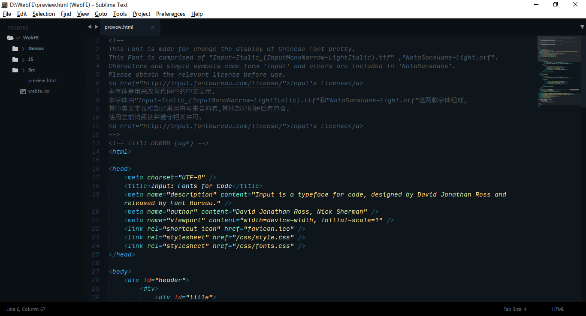

# Conf4ST3
  Sublime Text 3 Configs for self-use.
### About License
This Font is made for change the display of Chinese Font pretty.
This Font is comprised of "Input-Italic_(InputMonoNarrow-LightItalic).ttf" ,"NotoSansHans-Light.otf".
Characters and simple symbols come form 'Input' and others are included in 'NotoSansHans'.
Please obtain the relevant license before use.<a href="http://input.fontbureau.com/license/">Input's License</a>.
### **相关许可**
本字体初衷是用来改善代码中的中文显示,字体由"Input-Italic_(InputMonoNarrow-LightItalic).ttf"和"NotoSansHans-Light.otf"这两款字体组成,
其中英文字母和部分常用符号来自前者,其他部分则是后者包含.
使用之前请阅读并遵守相关许可.<a href="http://input.fontbureau.com/license/">Input's License</a> 
###

### How To Use
preferences-Settings-User
**
\"\{ &nbsp;&nbsp;&nbsp;"font_face": "Noto Sans S Chinese Light", 
\}\"
